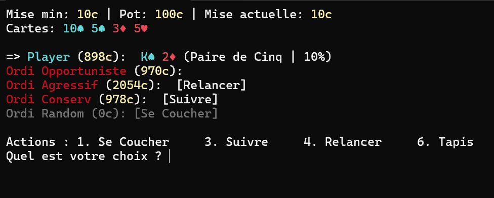

# Casino All-In

    [](https://sonarcloud.io/summary/new_code?id=Korgys_casino-all-in) [](https://sonarcloud.io/summary/new_code?id=Korgys_casino-all-in) [](https://sonarcloud.io/summary/new_code?id=Korgys_casino-all-in) [](https://sonarcloud.io/summary/new_code?id=Korgys_casino-all-in) [](https://sonarcloud.io/summary/new_code?id=Korgys_casino-all-in) [](https://sonarcloud.io/summary/new_code?id=Korgys_casino-all-in) [](https://sonarcloud.io/summary/new_code?id=Korgys_casino-all-in) [](https://sonarcloud.io/summary/new_code?id=Korgys_casino-all-in)   

## Overview

Casino All-In is a console-based casino project built with .NET. It is designed as a portfolio showcase to demonstrate:

- Clean architecture separation (`casino.core` / `casino.console`)
- Game logic modeling (deck, rounds, actions, scoring)
- Automated tests for core rules and console behavior

### Gameplay preview



## Features

- **Texas Hold'em** game in the terminal with betting phases (Pre-Flop, Flop, Turn, River, Showdown).
- **Blackjack** game in the terminal (hit/stand loop, dealer draw rules, winner resolution).
- **Slot Machine** game in the terminal with animated reels, combo payouts, and jackpot spins.
- Computer players with multiple strategies (aggressive, conservative, opportunistic, random).
- Poker action flow support: fold, check, call, raise, bet, all-in.
- Poker hand evaluation and winner resolution.
- Console renderer for table state, actions, and game progression
- Unit tests for game engine and console layer.

## Installation

### Prerequisites

- [.NET SDK 10.0](https://dotnet.microsoft.com/) (target framework: `net10.0`)
- or Docker

### Option A — Run with .NET CLI

```bash
git clone https://github.com/<your-username>/casino-all-in.git
cd casino-all-in
dotnet restore
dotnet run --project casino.console
```

### Option B — Run with Docker

```bash
git clone https://github.com/<your-username>/casino-all-in.git
cd casino-all-in
docker build -t casino-all-in -f casino.console/Dockerfile .
docker run --rm -it casino-all-in
```

## Usage

1. Launch the app (CLI or Docker).
2. Choose a game (Poker, Blackjack, or Slot Machine).
3. Follow prompts in the terminal to choose actions (`check`, `call`, `raise`, `fold`, `all-in`, `hit`, `stand`, etc.).
4. Play rounds until the game ends, then choose whether to start a new game.

### Run tests

```bash
dotnet test
```

## Project Structure

```text
casino-all-in/
├── casino.core/           # Domain/game engine (rules, cards, scores, phases, players, slots)
├── casino.console/        # Console application (entrypoint, renderer, input handling)
├── casino.core.tests/     # Unit tests for core poker logic
├── casino.console.tests/  # Unit tests for console behaviors
├── casino-all-in.slnx
└── README.md
```

## Poker Rules

This project implements a simplified Texas Hold'em loop:

- Each player receives two private cards.
- Community cards are revealed in 3 stages: **Flop (3)**, **Turn (1)**, **River (1)**.
- Players can act each betting round depending on game state (check, bet, call, raise, fold, all-in).
- At showdown, the best 5-card hand (from 7 available cards) determines the winner.
- Standard ranking order is used (High Card → One Pair → Two Pair → Three of a Kind → Straight → Flush → Full House → Four of a Kind → Straight Flush).

## Roadmap

- [ ] Add additional casino games (Roulette, Craps, etc.).
- [ ] Improve UI/UX with richer console animations/colors.
- [ ] Add configurable game setup (number of bots, starting stacks, blinds).
- [ ] Add localization options (FR/EN prompts and messages).

## License

Distributed under the MIT License. See [`LICENSE`](LICENSE) for details.
